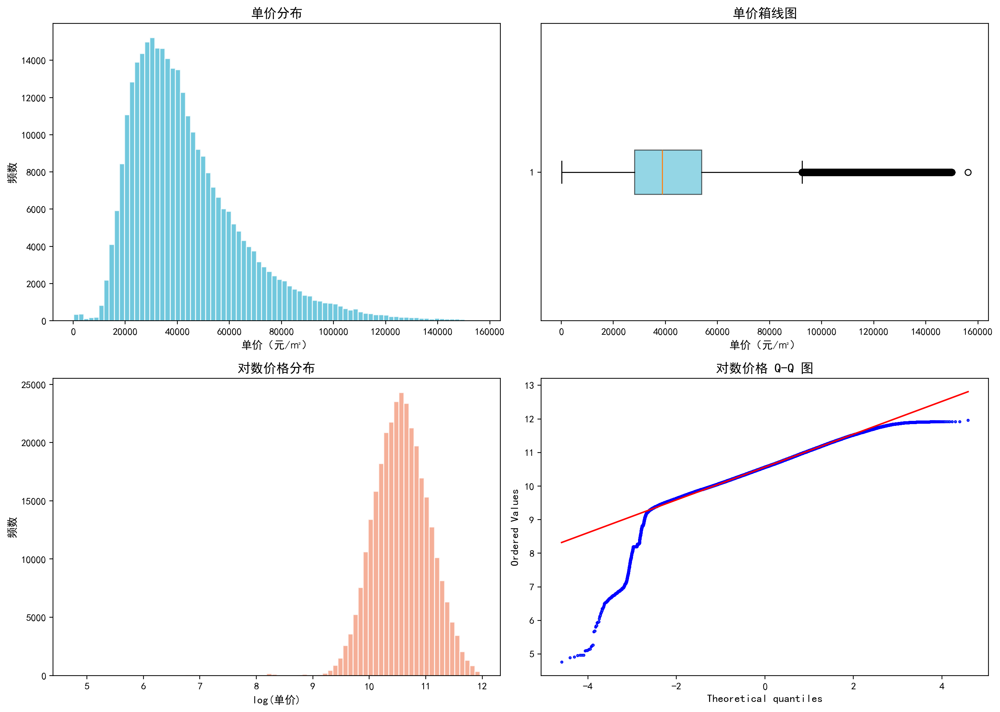
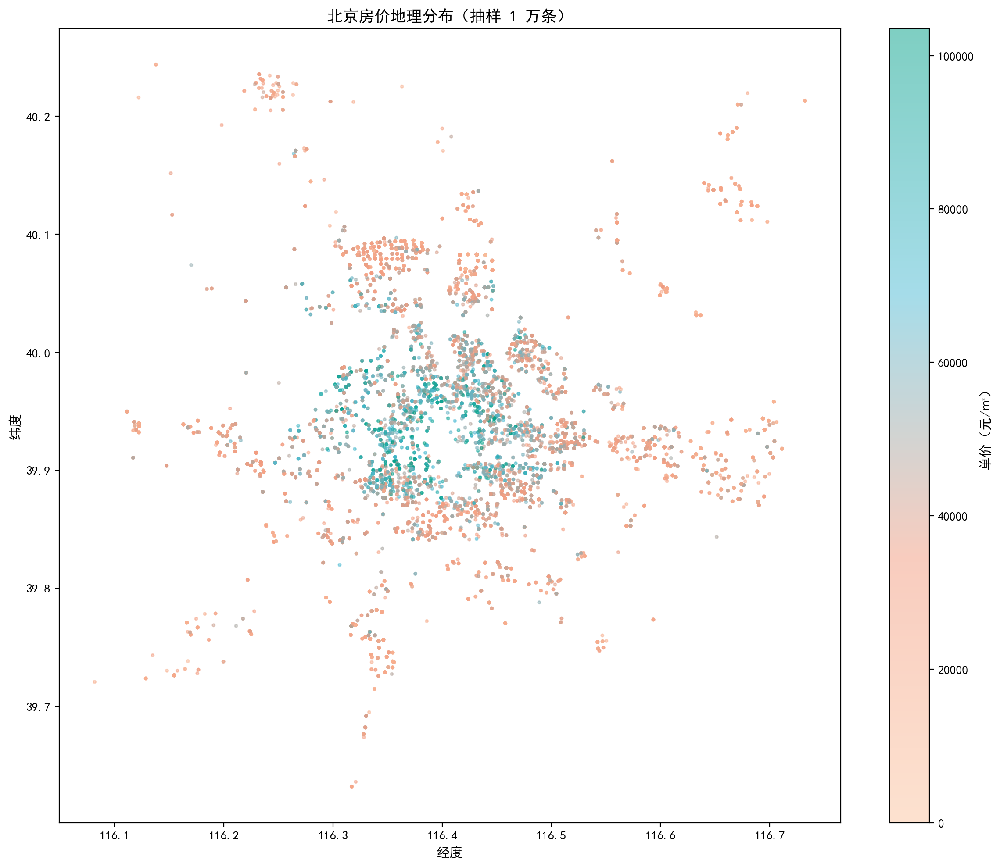
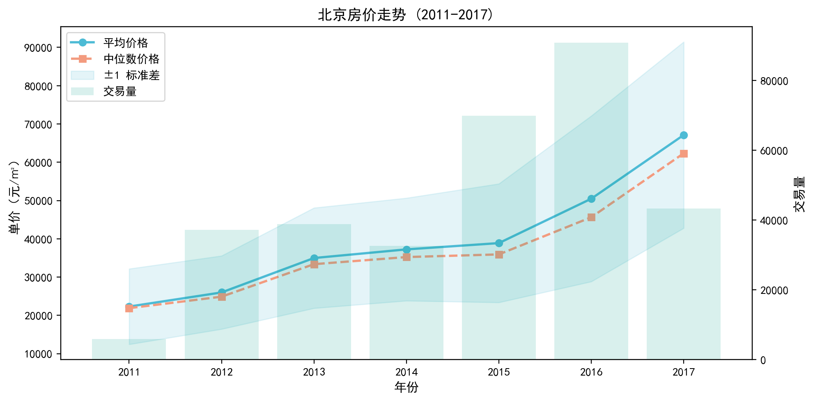
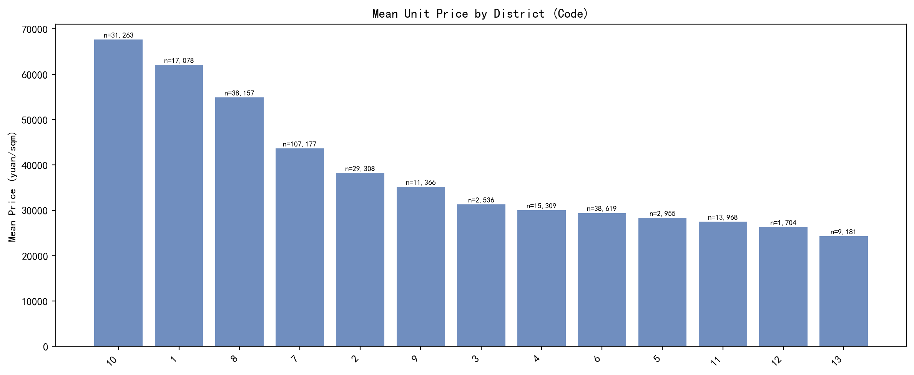
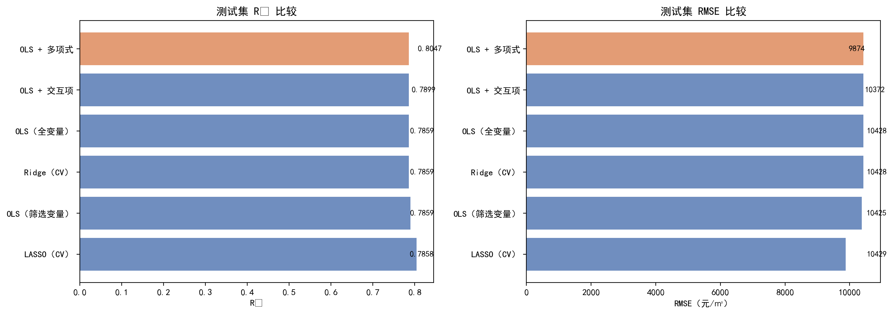
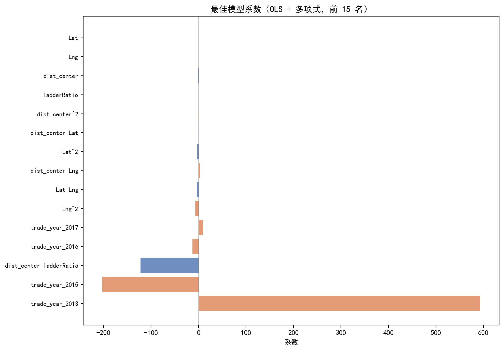
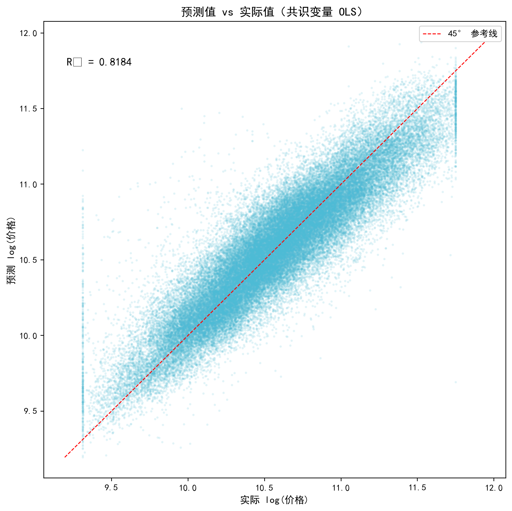
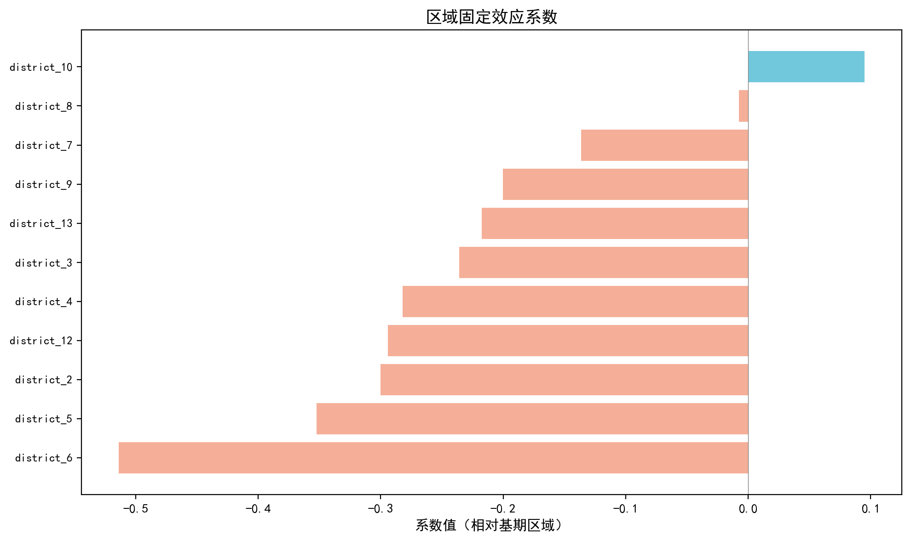
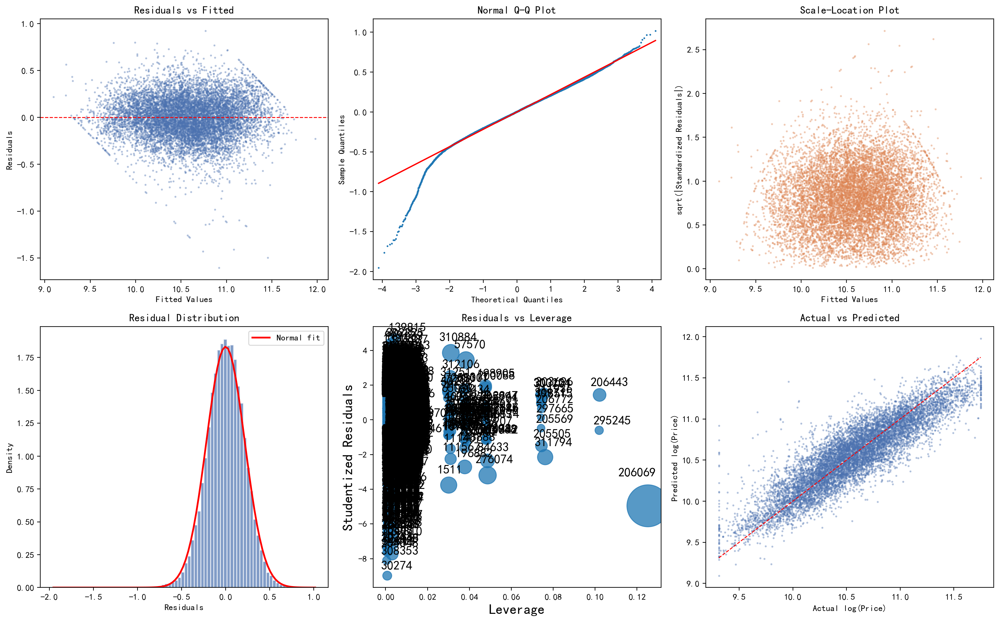
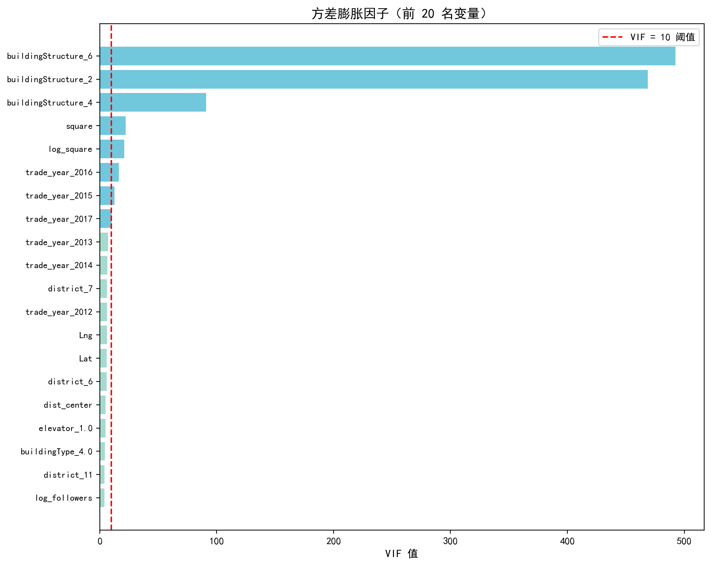

<div align="center">

# 北京市住房价格由什么决定？

**基于特征价格模型与 31.8 万条链家二手房成交记录的多元回归实证研究**

</div>

---

## 一句话结论

> 在 2011–2017 年北京 **318,160** 条二手房成交记录上，用带时间—区域双向固定效应的半对数特征价格模型（**64** 个特征）估计：**空间因素是房价的主导变量**——距市中心距离的对数系数为 **−2.726**，每远离市中心 0.01 度（约 1.1 km）单价下降约 **2.7%**；房屋属性中电梯溢价 **+7.7%**、临近地铁 **+5.8%**、梯户比每增加 0.1 约 **+1.7%**。
>
> 但这些数字**无法从均值或相关系数直接读出来**：近地铁房源的朴素均值溢价高达 **+27.6%**，控制区位后只剩 **+5.8%**；而"精度最高"的多项式模型虽然把 $R^{2}$ 从 **0.8185** 提升到 **0.8294**（RMSE 9,411 元/㎡），代价是条件数恶化到 $1.11\times10^{12}$、系数膨胀到 ±800 量级而失去经济含义。**因此本文以线性主效应模型作为经济推断的依据，而非精度最高的多项式模型。**

完整论文见 [`report/paper.pdf`](report/paper.pdf)（中文，正文 7 节 + 完整代码附录）。

---

## 目录

- [一、研究问题：为什么不能只看均值与相关系数](#一研究问题为什么不能只看均值与相关系数)
- [二、核心发现](#二核心发现)
- [三、方法原理](#三方法原理)
- [四、实证结果](#四实证结果)
- [五、项目结构](#五项目结构)
- [六、复现指南](#六复现指南)
- [七、这个项目体现了哪些能力](#七这个项目体现了哪些能力)
- [八、局限与已知问题](#八局限与已知问题)
- [九、参考文献与引用](#九参考文献与引用)
- [十、致谢与 AI 使用声明](#十致谢与-ai-使用声明)

---

## 一、研究问题：为什么不能只看均值与相关系数

住房兼具消费与投资属性，其价格形成机制是城市经济学的核心议题。特征价格模型（hedonic pricing model）认为异质性商品的价格由其所含特征的隐含价格决定，因此"哪些特征值多少钱"看似可以用简单统计回答。但**本项目数据本身**就展示了四类无法用朴素统计回答的原因：

| 问题 | 数据事实（本项目重算） | 后果 |
|------|------------------------|------|
| 数据泄露 | `communityAverage`（社区均价）与单价相关系数 **0.685**，`totalPrice`（总价）**0.622**，两列都居相关性榜首 | 总价 = 单价 × 面积，社区均价则直接由邻近成交价构成；纳入即"用结果预测结果"，必须删除 |
| 混淆偏误 | 近地铁房源均价 47,682 元/㎡ vs 非近地铁 37,360 元/㎡，**朴素溢价 +27.6%**（对数均值差 +29.0%） | 地铁线路集中在中心城区，朴素对比把"区位效应"算成了"地铁效应"，控制区位后仅剩 **+5.8%** |
| 线性相关掩盖真实影响 | 纬度、经度与单价的相关系数仅 **−0.052**、**−0.153**，但距市中心距离相关系数达 **−0.476**，回归系数 **−2.726** | 北京是单中心城市，价格沿"到中心的径向距离"衰减；单个经纬度坐标与单价并非单调关系 |
| 时间非线性 | 年均单价从 2011 年 **22,299** 元/㎡ 升至 2017 年 **67,116** 元/㎡；2015→2016 单年跳升 **+29.8%** | 把年份当连续变量会强加"年增幅恒定"的约束，必然低估 2015 年后的涨幅 |

此外还有两类工程性问题：**高缺失**——挂牌天数 `DOM` 缺失率 **49.6%**，且缺失本身携带信息（`DOM_missing` 的系数为 −0.028，p = 7.9×10⁻¹⁶⁵，缺失房源系统性更便宜），不能简单删除；**类别极不平衡**——建筑结构类别 6 占样本 **59.0%**，而类别 0/1/3/5 各自不足 0.1%，导致相应虚拟变量近乎共线（最大 VIF 达 **492.4**）。

<table>
<tr>
<td width="50%"></td>
<td width="50%"></td>
</tr>
<tr>
<td align="center"><b>图 1</b>　单价右偏（偏度 1.31）与对数变换后趋近对称（偏度 −0.59）</td>
<td align="center"><b>图 2</b>　抽样 1 万条的房价地理分布：典型的单中心放射状衰减</td>
</tr>
</table>

<table>
<tr>
<td width="50%"></td>
<td width="50%"></td>
</tr>
<tr>
<td align="center"><b>图 3</b>　2011–2017 年度价格趋势：2015 年后加速攀升</td>
<td align="center"><b>图 4</b>　13 个区域编码的平均单价：最高 67,681 vs 最低 24,300 元/㎡（2.79 倍）</td>
</tr>
</table>

这四类问题决定了研究设计：**删除泄露变量、用半对数设定压缩右偏、用年度+月度虚拟变量替代时间趋势、用时间—区域双向固定效应吸收区位混淆、用稳健标准误应对异方差**。

---

## 二、核心发现

| 结论 | 证据来源 | 关键数值 |
|------|----------|----------|
| 空间因素是房价的主导变量 | [`consensus_ols_coefficients.csv`](output/tables/consensus_ols_coefficients.csv) | `dist_center` 系数 **−2.726**（每 0.01 度约 −2.7%）；`Lat` +1.110、`Lng` −0.521 |
| 区域间价格差接近 3 倍 | [`descriptive_stats.csv`](output/tables/descriptive_stats.csv) 重算 | 区域均价 24,300 – 67,681 元/㎡；样本量最小 1,704、最大 107,177 条 |
| 近地铁溢价远小于朴素对比 | 描述统计 vs 回归系数 | 朴素 **+27.6%** → 控制区位后 **+5.8%**（高估约 4.8 倍） |
| 电梯与梯户比有稳健的资本化效应 | [`consensus_ols_coefficients.csv`](output/tables/consensus_ols_coefficients.csv) | `elevator` **+7.7%**、`ladderRatio` 每 +0.1 约 **+1.7%**；相反朴素均值差仅 +5.2%（低估） |
| 时间趋势必须用虚拟变量刻画 | [`consensus_ols_coefficients.csv`](output/tables/consensus_ols_coefficients.csv) | 年份虚拟系数 2012 +0.167 → 2017 **+1.172**（即 2017 年价格约为 2011 年基准的 3.2 倍） |
| LASSO 在本数据上退化为 OLS | [`selection_comparison.csv`](output/tables/selection_comparison.csv) | 最优 $\alpha=10^{-4}$ 恰在搜索网格下界，仍保留 60/64 个非零系数；59 个共识变量 |
| 六种模型精度差距其实很小 | [`model_comparison.csv`](output/tables/model_comparison.csv)、[`cv_comparison.csv`](output/tables/cv_comparison.csv) | 多项式 $R^2$ **0.8294** / RMSE **9,411**；线性主效应 **0.8185** / **9,696**；5 折 CV 0.8295±0.0017 vs 0.8187±0.0017 |
| 高阶项以可解释性为代价 | [`vif_results.csv`](output/tables/vif_results.csv)、脚本 04 输出 | 条件数 1.67×10⁴（全变量）→ **1.41×10¹⁶**（交互项）/ **1.11×10¹²**（多项式），远超 10⁶ 阈值 |
| 异方差存在，但推断稳健 | [`heteroscedasticity_tests.csv`](output/tables/heteroscedasticity_tests.csv) | BP 检验 p = **1.8×10⁻¹⁵⁹**（拒绝同方差），GQ 检验 p = 0.857；HC3 后仅 **1/64** 个变量显著性判断改变 |
| `DOM` 缺失处理不改变核心结论 | [`dom_robustness.csv`](output/tables/dom_robustness.csv) | $R^2$ 0.8185 → 0.8175；核心变量系数最大变化 **0.89%**（`Lng`） |

<table>
<tr>
<td width="50%"></td>
<td width="50%"></td>
</tr>
<tr>
<td align="center"><b>图 5</b>　六种模型的测试集 $R^2$ 与 RMSE：精度提升有限</td>
<td align="center"><b>图 6</b>　共识变量 OLS 系数（前 15 名）：空间变量占据绝对主导</td>
</tr>
</table>

> **一句话解读**：房价的空间结构性差异（区位）远大于房屋硬件属性的差异；但区位因素在朴素统计里恰恰最难被识别——它既会被地铁等"看起来很强"的变量冒名顶替，也会在单个经纬度坐标的相关系数里被稀释。

---

## 三、方法原理

### 3.1 基准模型：带双向固定效应的半对数特征价格方程

以对数单价为响应变量，设定含时间与区域固定效应的回归方程：

$$
\log(\text{Price}_{it}) = \beta_0 + \boldsymbol{X}_{it}'\boldsymbol{\beta} + \gamma_t + \delta_k + \varepsilon_{it}
$$

其中 $\boldsymbol{X}_{it}$ 为连续与二元房屋/区位特征（距市中心距离、经纬度、建筑面积对数、梯户比、挂牌天数、电梯、地铁等）；$\gamma_t$ 为时间固定效应，由 **6 个年度虚拟变量**（2011 年为基期）与 **11 个月度虚拟变量**（1 月为基期）共同实现；$\delta_k$ 为 **12 个区域虚拟变量**（13 个区域编码，1 个为基期）。

采用半对数（log-level）设定的原因有两层：一是单价右偏严重（偏度 1.31 → 对数后 −0.59），对数变换让分布对称并压缩极端值的影响；二是系数的解释天然是**半弹性**——连续变量 $\beta$ 的精确解释为"该变量增加 1 个单位时价格变化 $100\times(e^{\beta}-1)\%$"。

### 3.2 多项式扩展模型：允许非线性，但记录其代价

为考察关键连续变量的非线性边际效应，对 `dist_center`、`Lat`、`Lng`、`ladderRatio`、`DOM` 共 5 个变量做二阶完全扩展：

$$
\log(\text{Price}) = \beta_0 + \boldsymbol{X}'\boldsymbol{\beta} + \boldsymbol{Z}'\boldsymbol{\gamma} + \text{vec}(\boldsymbol{Z} \otimes \boldsymbol{Z})'\boldsymbol{\theta} + \varepsilon
$$

$\boldsymbol{Z} \otimes \boldsymbol{Z}$ 包含全部二次项与两两交互项。`trade_year` 不再参与扩展——时间非线性已由年度虚拟变量灵活捕捉，若再引入其平方项只会人为制造共线性。

### 3.3 变量选择的共识策略

在 64 维特征空间中用三种方法独立筛选：基于 AIC 的向前选择、基于 AIC 的向后剔除、LASSO 正则化路径（5 折交叉验证选 $\alpha$）。**被至少 2 种方法选中的变量进入最终变量集（59 个）**，以降低单一选择准则带来的偶然性。核验结果：29 个变量三票一致、30 个两票、3 个单票、2 个未入选。

### 3.4 工程选择（为什么这样做）

- **手写影响诊断而非调用 `statsmodels.get_influence()`**：在 254,528 × 64 的规模上，`get_influence()` 需要构造完整的影响矩阵，实测无法在合理时间内完成。脚本 04 改为直接计算帽子矩阵对角元 $h_{ii}=\text{diag}(\boldsymbol{X}(\boldsymbol{X}'\boldsymbol{X})^{-1}\boldsymbol{X}')$，再据此推导外部学生化残差与 Cook's 距离（[`scripts/04_model_diagnostics.py`](scripts/04_model_diagnostics.py)）。
- **回归诊断在 20,000 行随机子样本上完成**：子样本的样本/特征比超过 300:1，对 VIF、BP、DW 等诊断统计量充分；这一妥协在第八节如实记录。
- **删除泄露变量**：`communityAverage`、`totalPrice` 与目标变量存在确定性或半确定性关系，`Cid`、`url`、`id` 无泛化价值，共删除 5 列。
- **标准化只作用于数值特征**：16 个数值特征经 `StandardScaler` 标准化后供 Ridge/LASSO 使用，48 个虚拟变量保持 0/1 原值，避免破坏哑变量的解释性。
- **缺失值处理保留"缺失信息"**：`DOM` 中位数填充 + 新增 `DOM_missing` 指示变量，使缺失模式本身可被模型识别（其系数确实显著为负）。
- **全流程固定随机种子 42**（划分、子样本抽取、LASSO 交叉验证、多项式诊断子样本），保证结果可复现。

---

## 四、实证结果

### 4.1 描述统计与空间格局

| 变量 | 均值 | 标准差 | 中位数 | 最小值 | 最大值 |
|------|------|--------|--------|--------|--------|
| 单价（元/㎡） | 43,561.9 | 21,685.3 | 38,752.0 | 117.0 | 156,250.0 |
| 对数单价 | 10.57 | 0.54 | 10.56 | 4.77 | 11.96 |
| 距市中心距离（度） | 0.12 | 0.07 | 0.10 | 0.00 | 0.51 |
| 建筑面积（㎡） | 83.2 | 37.2 | 74.3 | 6.9 | 1,745.5 |
| 梯户比（1% 截尾） | 0.39 | 0.22 | 0.33 | 0.10 | 1.00 |
| 挂牌天数 | 28.8 | 50.2 | 6.0 | 1.0 | 1,677.0 |
| 建造年份 | 1,999.0 | 22.5 | 2,001.0 | 0.0 | 2,016.0 |
| 有电梯（比例） | 0.577 | — | — | 0 | 1 |
| 临近地铁（比例） | 0.601 | — | — | 0 | 1 |
| 满五年（比例） | 0.646 | — | — | 0 | 1 |

（数据来源：[`output/tables/descriptive_stats_latex.tex`](output/tables/descriptive_stats_latex.tex)，由 [`scripts/00_descriptive_table.py`](scripts/00_descriptive_table.py) 生成；关键变量中文注释见 [`output/results_log.md`](output/results_log.md)。）

把距市中心距离按五分位分组后，均价从最内圈的 **59,463** 元/㎡ 单调下降到最外圈的 **29,593** 元/㎡（约 2 倍），这是单中心城市空间衰减格局的直接证据。

### 4.2 六种模型的预测表现

| 模型 | $R^{2}$ | RMSE（元/㎡） | MAE（元/㎡） | AIC |
|------|:---:|:---:|:---:|:---:|
| **OLS + 多项式** | **0.8294** | **9,411** | **6,471** | **−207,770** |
| OLS + 交互项 | 0.8218 | 9,621 | 6,631 | −205,038 |
| OLS（全变量） | 0.8185 | 9,696 | 6,703 | −203,859 |
| Ridge（CV，$\alpha$=0.49） | 0.8185 | 9,696 | 6,703 | — |
| OLS（共识变量 59 个） | 0.8184 | 9,695 | 6,703 | −203,867 |
| LASSO（CV，$\alpha=10^{-4}$） | 0.8180 | 9,710 | 6,713 | — |

5 折交叉验证给出同序结论（多项式 0.8295±0.0017，其余约 0.8187±0.0017），排除过拟合。值得注意的是 **OLS、Ridge、LASSO、共识变量 OLS 四者的 $R^2$ 相差不足 0.0005**——LASSO 因惩罚力度极弱而退化，Ridge 在 64 维上几乎没有收缩空间，这也从侧面说明"变量很多但每个都真实有效"。

<table>
<tr>
<td width="50%"></td>
<td width="50%"></td>
</tr>
<tr>
<td align="center"><b>图 7</b>　共识变量 OLS 在测试集上的预测 vs 实际（高价区间略有低估）</td>
<td align="center"><b>图 8</b>　区域固定效应系数（相对基期区域）</td>
</tr>
</table>

### 4.3 核心变量的边际效应

以下基于共识变量 OLS（对数尺度系数见 [`consensus_ols_coefficients.csv`](output/tables/consensus_ols_coefficients.csv)）：

- **空间**：`dist_center` = −2.726。即距天安门每增加 0.01 度（约 1.1 km），单价下降约 $100\times(e^{-0.0273}-1)=-2.69\%$，相当于每公里约 −2.4%；按 2017 年样本均价 67,116 元/㎡ 计，约合每公里 1,600 元/㎡。`Lat` = +1.110、`Lng` = −0.521 捕捉了南北/东西方向的额外梯度（北京北部（海淀、朝阳）整体高于南部）。
- **电梯**：`elevator_1.0` = +0.0739 → $e^{0.0739}-1 = +7.7\%$。对 80 ㎡ 住房，按 5 万元/㎡ 计约合 30 万元溢价。
- **交通**：`subway_1.0` = +0.0559 → **+5.8%**，仅为朴素均值差（+27.6%）的五分之一左右。
- **居住舒适度**：`ladderRatio` = +0.165，梯户比每增加 0.1，单价上升约 1.7%。
- **时间**：年份虚拟系数单调递增（2012 +0.167、2013 +0.505、2014 +0.502、2015 +0.552、2016 +0.845、2017 +1.172），其中 2012→2013 有一次大跳跃，2015 年后再次加速，与图 3 的分年度走势一致。月度系数从 2 月 +0.039 升至 12 月 +0.195，反映年内季节性上行。

### 4.4 回归诊断

| 检验项目 | 结果 | 判断 |
|----------|------|------|
| VIF > 10 的变量数（不含截距） | 8 个：`buildingStructure_6/2/4`、`square`、`log_square`、`trade_year_2016/2015/2017` | 存在局部共线性 |
| 最大 VIF（不含截距） | **492.4**（`buildingStructure_6`） | 由该类别占比 59.0% 造成 |
| 条件数 | 全变量 OLS **1.67×10⁴**；交互项 **1.41×10¹⁶**；多项式 **1.11×10¹²** | 前两者可接受，后两者严重病态 |
| Breusch-Pagan | LM = 957.6，p = **1.8×10⁻¹⁵⁹** | 拒绝同方差 |
| Goldfeld-Quandt | F = 0.979，p = **0.857** | 不拒绝同方差 |
| Durbin-Watson | **1.966** | 无自相关 |
| Cook's D 超阈值比例 | 947 / 20,000 = **4.74%** | 存在少量强影响点 |
| HC3 后显著性改变的变量 | **1 个**（`fiveYearsProperty_1.0`：p 0.048 → 0.053） | 推断稳健 |

BP 与 GQ 结论不一致并不矛盾：BP 对一般形式的异方差敏感，GQ 只对按排序后的单调方差变化敏感；残差诊断图中"随拟合值增大而扩散"的漏斗形支持 BP 的结论。实践上，**半对数设定已在数据变换层面压缩了方差随价格递增的趋势，HC3 稳健标准误再做一次事后修正**，因此核心变量的推断不受影响。

<table>
<tr>
<td width="50%"></td>
<td width="50%"></td>
</tr>
<tr>
<td align="center"><b>图 9</b>　残差 vs 拟合值（漏斗形）、Q-Q 图、尺度—位置图等六联诊断</td>
<td align="center"><b>图 10</b>　VIF 前 20 名（红色虚线为 VIF = 10 阈值）</td>
</tr>
</table>

### 4.5 多项式模型的系数膨胀：一个方法论教训

多项式模型预测精度最高，但它的系数不再可用：条件数从全变量 OLS 的 $1.67\times10^{4}$ 恶化到 $1.11\times10^{12}$（多项式）与 $1.41\times10^{16}$（交互项），部分系数绝对值达到 200–800 的量级。原因在于**区域虚拟变量本身就是地理空间的离散化表示，而经纬度的多项式组合是对同一空间的连续函数逼近**，二者高度相关使 $\boldsymbol{X}'\boldsymbol{X}$ 近乎奇异。

这揭示了一个取舍：当研究目标是**经济推断**（inference）而非**预测**（prediction）时，系数可解释性的价值高于 1.1 个百分点的 $R^2$。本项目因此选择线性主效应模型作为结论依据，并在 [`report/paper.tex`](report/paper.tex) 第五节（`sec:poly_inflation`）中完整记录了这一权衡。

### 4.6 稳健性：`DOM` 缺失值处理

| 设定 | $R^{2}$ | 核心系数最大变化 |
|------|:---:|:---:|
| 含 `DOM` + `DOM_missing`（基准） | 0.8185 | — |
| 完全剔除 `DOM` 与 `DOM_missing` | 0.8175 | **0.89%**（`Lng`：−0.507 → −0.511） |

同时 `DOM_missing` 系数为 **−0.028**（p = 7.9×10⁻¹⁶⁵），说明挂牌天数缺失的房源系统性地更便宜，缺失并非随机。两项证据合起来表明：`DOM` 的处理方式未对核心推断构成实质威胁。

---

## 五、项目结构

```
现代回归分析/
├── data/
│   └── lianjia_beijing.csv      # 链家北京二手房成交数据（318,851 × 26，gbk 编码）
├── scripts/                     # 分析脚本，按编号顺序执行
│   ├── 00_descriptive_table.py  # 论文用描述统计表（LaTeX）
│   ├── 01_exploratory.py        # 探索性分析：分布、相关、地理、时间趋势
│   ├── 02_preprocessing.py      # 清洗、插补、Winsorize、特征工程、独热编码、划分
│   ├── 03_variable_selection.py # 向前 AIC + 向后 AIC + LASSO → 共识变量集
│   ├── 04_model_diagnostics.py  # VIF、异方差、自相关、影响点、HC3、条件数
│   ├── 05_model_comparison.py   # 六模型比较 + 5 折 CV + DOM 稳健性检验
│   └── strip_comments.py        # 为论文附录生成去注释版代码
├── output/
│   ├── figures/                 # 图表（01_eda / 03_selection / 04_diagnostics / 05_comparison）
│   ├── tables/                  # 全部数值结果（CSV），论文中每个数字都可回溯到这里
│   └── results_log.md           # 逐脚本的数值结果记录
├── report/
│   ├── paper.tex                # 中文 LaTeX 论文（ctexart，XeLaTeX）
│   ├── paper.pdf                # 编译后的论文
│   ├── code/                    # 论文附录用的去注释代码
│   └── build.bat               # 两遍 xelatex 编译脚本
├── utils.py                     # 共享工具：字体/配色、数据加载、图表与表格落盘
├── requirements.txt
└── LICENSE                      # 代码 MIT；论文 CC BY 4.0
```

> **工作流设计**：脚本只负责"计算并落盘"，**不在代码里打印分析结论**；所有解读集中写入 [`output/results_log.md`](output/results_log.md)，论文正文再从日志中提炼。这样保证"代码 → 数值 → 文字"链条可逐项核对：本 README 中的每个数字都能指回 `output/tables/` 中的某个文件或 `results_log.md` 中的某一行。

---

## 六、复现指南

### 环境要求

- Python **3.11**（开发环境：Anaconda `python31111`）；实测版本 pandas 3.0.3、numpy 2.4.6、scipy 1.17.1、matplotlib 3.11.0、seaborn 0.13.2、statsmodels 0.15.0、scikit-learn 1.9.0、joblib 1.5.3
- 论文编译（可选）：TeX Live + **XeLaTeX**（`ctexart` 文档类，需中文字体 SimSun/SimHei）

### 步骤

```bash
# 1) 安装依赖
pip install -r requirements.txt

# 2) 数据：仓库已包含 data/lianjia_beijing.csv（约 56 MB）
#    如需从源头重新获取（需配置 Kaggle API token）：
#    kaggle datasets download -d ruiqurm/lianjia -p data --unzip
#    注意：脚本用 encoding="gbk" 读取该文件

# 3) 按编号顺序执行（脚本会自动定位项目根目录，可在任意工作目录下运行）
python scripts/00_descriptive_table.py    # 描述统计表（秒级）
python scripts/01_exploratory.py          # 探索性图表（1 分钟左右）
python scripts/02_preprocessing.py        # 预处理 → output/*.pkl（1–2 分钟）
python scripts/03_variable_selection.py   # 变量选择（耗时较长：逐步回归迭代次数多）
python scripts/04_model_diagnostics.py    # 诊断检验（耗时较长：VIF 逐变量回归 + 影响点）
python scripts/05_model_comparison.py     # 六模型 + 交叉验证（耗时较长）

# 4) 可选：重新编译论文
cd report && build.bat        # 等价于 xelatex paper.tex 跑两遍
```

### 预期产物

运行完成后 `output/` 下应出现 20 张 PNG 图表、9 个 CSV/TeX 结果表，以及 3 个中间数据文件（`processed_data.pkl`、`scaled_data.pkl`、`scaler.pkl`，被 `.gitignore` 排除，可由脚本 02 重新生成）。

### 可复现性措施

- 随机种子统一为 **42**：训练/测试划分、子样本抽取、LASSO 交叉验证、诊断子样本，均显式固定；
- 每个脚本开头把项目根目录插入 `sys.path`，因此依赖相对路径的读写不受当前工作目录影响；
- 脚本 03 依赖脚本 02 的 `output/*.pkl`，脚本 05 依赖脚本 03 的 `selection_results.pkl`，**必须按编号顺序执行**；
- 所有数值结果落盘（CSV，含系数、p 值、$R^2$、RMSE、AIC 等），论文与本 README 的数值均可回溯。

---

## 七、这个项目体现了哪些能力

| 能力维度 | 在本项目中的具体体现 | 对应产出 |
|----------|----------------------|----------|
| 回归建模理论 | 半对数特征价格模型设定、双向固定效应、半弹性的精确解释（$e^{\beta}-1$ 而非近似 $\beta$） | [`report/paper.tex`](report/paper.tex) 第 4 节 |
| 变量选择方法 | 向前 AIC / 向后 AIC / LASSO 三法对照，并用"至少 2 票"共识策略降低选择偶然性 | [`scripts/03_variable_selection.py`](scripts/03_variable_selection.py)、[`selection_comparison.csv`](output/tables/selection_comparison.csv) |
| 正则化与模型比较 | Ridge / LASSO 的 CV 调参、六模型测试集＋5 折交叉验证的双重评估、AIC/BIC 对照 | [`scripts/05_model_comparison.py`](scripts/05_model_comparison.py) |
| 计量诊断 | 多重共线性（VIF、条件数）、异方差（BP、GQ）、自相关（DW）、影响点（Cook's D、杠杆值）、稳健标准误（HC3） | [`scripts/04_model_diagnostics.py`](scripts/04_model_diagnostics.py) |
| 数值计算与性能取舍 | 手写帽子矩阵对角元与外部学生化残差，绕开 `get_influence()` 在大样本上的性能瓶颈；诊断改用 20,000 行子样本 | 同上，脚本 04 第 65–93 行 |
| 数据工程 | 318,851 × 26 脏数据清洗（`#NAME?`、中文"未知"、bathRoom=2011 之类的错误值）、Winsorize 截尾、缺失指示变量、独热编码与标准化分离 | [`scripts/02_preprocessing.py`](scripts/02_preprocessing.py) |
| 数据可视化 | matplotlib / seaborn 出版级图表：六联残差诊断、相关热图、地理散点、VIF 条形图、LASSO 路径、系数条形图，统一学术蓝橙配色 | `output/figures/` |
| 学术写作与排版 | 中文 LaTeX 论文：公式推导、三线表、矢量插图、参考文献、去注释代码附录、两遍编译流程 | [`report/paper.pdf`](report/paper.pdf) |
| 可复现研究规范 | 固定种子、脚本编号与依赖顺序、代码与结论严格分离、结果全部落盘可回溯 | 全仓库 + [`output/results_log.md`](output/results_log.md) |

**阅读路径建议**：本页（5 分钟）→ [`report/paper.pdf`](report/paper.pdf)（约 15 分钟，含完整推导与结论）→ [`output/results_log.md`](output/results_log.md)（逐脚本的数值与解读）→ `scripts/`（实现细节）→ [`output/tables/`](output/tables)（核对任一数字）。

---

## 八、局限与已知问题

项目在方法上尽力保持严谨，但以下局限与不一致**如实列出**，以免读者被过高的预期误导：

- **结果应解释为条件相关性，而非因果效应**。数据是链家平台的观测成交记录，未处理内生性（如"装修好的房子本就更贵且更可能装电梯"）。此外未控制**空间自相关**——若邻近房源误差项存在空间聚类，OLS 系数仍一致，但标准误可能偏小、显著性检验偏宽松。考虑到核心变量（如距市中心距离 −2.7%/公里）的量级很大，空间依赖不太可能逆转主要结论的方向，但精确的显著性判断需要空间计量模型（SAR/SEM）复核。
- **平台选择偏误**：仅覆盖链家一家中介的成交记录，未涵盖新房、其他中介与非公开交易，样本对市场整体的代表性有限。
- **`DOM` 缺失率 49.6%**：中位数填充 + 缺失指示变量缓解了偏倚，但若缺失与未观测的价格决定因素相关，填充仍可能带来偏差。
- **诊断在 20,000 行子样本上完成**：受计算资源限制（见第 3.4 节），VIF、Cook's D、杠杆值均基于随机子样本。对"类别占比不足 0.1%"的稀有建筑结构类别，子样本中的表现可能不稳定，VIF 数值对抽取方式较敏感。
- **LASSO 未实现稀疏化**：最优 $\alpha$ 始终落在搜索网格下界，说明本数据的信号广泛分布而非稀疏。若把结论表述为"LASSO 选中了关键变量"会误导——它实际上退化为 OLS。
- **多项式模型的提升未被充分检验**：$R^2$ 仅提升约 1.1 个百分点，虽通过 5 折 CV 检验（未见明显过拟合），但未做如正则化多项式、样条等替代非线性设定作为对照。
- **论文与脚本记录存在若干数字不一致**（已核验）：`report/paper.tex` 中"区域 15 类"实为 **13 个区域编码（12 个虚拟变量）**；诊断表给出的条件数 $4.59\times10^{5}$ 与 `results_log.md` 记录的 $1.67\times10^{4}$ 不符，且把多项式条件数写成高于交互项（实测交互项 $1.41\times10^{16}$ > 多项式 $1.11\times10^{12}$）；"4 个变量仅被一种方法选中、1 个未被选中"实为 **3 个与 2 个**；"东城、西城均价超过 7 万元/㎡"与实测区域均值上限 67,681 元/㎡ 不符。**以 [`output/tables/`](output/tables) 与 [`output/results_log.md`](output/results_log.md) 为准。**
- **区域名称未落库**：原始数据只提供 1–13 的数值编码，仓库中没有任何"编码 → 行政区名"的映射文件，因此论文中出现的具体区县名称无法在数据层面验证。
- **数据随仓库分发**：`data/lianjia_beijing.csv` 为 56 MB 的原始数据副本，版权与使用条款归 Kaggle 数据集原作者，公开展示仅为复现便利。

后续可拓展的方向：空间计量模型（SAR/SEM）或空间 HAC 标准误、引入学区/地铁站点距离等外生变量、用工具变量或边界断点设计改善识别、合并稀有建筑结构类别以缓解共线性。

---

## 九、参考文献与引用

项目的方法基础：

1. Rosen, S. (1974). Hedonic prices and implicit markets: product differentiation in pure competition. *Journal of Political Economy*, 82(1), 34–55.
2. Lancaster, K. J. (1966). A new approach to consumer theory. *Journal of Political Economy*, 74(2), 132–157.
3. Tibshirani, R. (1996). Regression shrinkage and selection via the lasso. *Journal of the Royal Statistical Society: Series B*, 58(1), 267–288.
4. Breusch, T. S., & Pagan, A. R. (1979). A simple test for heteroscedasticity and random coefficient variation. *Econometrica*, 47(5), 1287–1294.
5. White, H. (1980). A heteroskedasticity-consistent covariance matrix estimator and a direct test for heteroskedasticity. *Econometrica*, 48(4), 817–838.
6. Sirmans, S. G., Macpherson, D. A., & Zietz, E. N. (2005). The composition of hedonic pricing models. *Journal of Real Estate Literature*, 13(1), 1–44.
7. 郑思齐, 刘洪玉 (2005). 住房需求的收入弹性: 模型、估计与预测. *土木工程学报*, 38(4), 85–89.

**引用本项目**：

```bibtex
@misc{ye2026beijinghousing,
  title  = {北京市住房价格影响因素分析：基于特征价格模型的多重回归实证研究},
  author = {Yei1y},
  year   = {2026},
  note   = {Course paper, Modern Regression Analysis},
  url    = {https://github.com/Yei1y/beijing-housing-regression}
}
```

**数据来源**：[Lianjia Beijing Second-hand Housing Transactions](https://www.kaggle.com/datasets/ruiqurm/lianjia)（Kaggle，2011–2017 年链家北京成交记录）。

---

## 十、致谢与 AI 使用声明

本项目的**研究问题设定、变量选择方案（泄露变量的识别与剔除、时间固定效应的设定方式、共识变量策略）、稳健性检验设计与全部结果解读**均由作者本人完成；**代码实现、调试与文档整理**环节使用了 AI 编程助手辅助。所有数值结果均由脚本实际运行产生并记录在 [`output/results_log.md`](output/results_log.md)，本 README 中的数字在撰写时重新回到原始数据与 `output/tables/` 逐项核验。

**许可证**：本仓库代码（[`scripts/`](scripts)、[`utils.py`](utils.py)、`output/`、本文档）采用 [MIT 许可证](LICENSE)；论文（[`report/`](report)）采用 [CC BY 4.0](https://creativecommons.org/licenses/by/4.0/)。原始数据 `data/lianjia_beijing.csv` 来自 Kaggle 公开数据集，不适用上述许可证，使用请遵循[数据集原始条款](https://www.kaggle.com/datasets/ruiqurm/lianjia)。

---

<div align="center">
<sub>研究问题：北京二手房价格由哪些因素决定、各值多少钱？ · 方法：半对数特征价格模型 + 双向固定效应 + 六模型比较与完整回归诊断 · 结论：区位主导，但区位效应在朴素统计中会被系统性误读</sub>
</div>